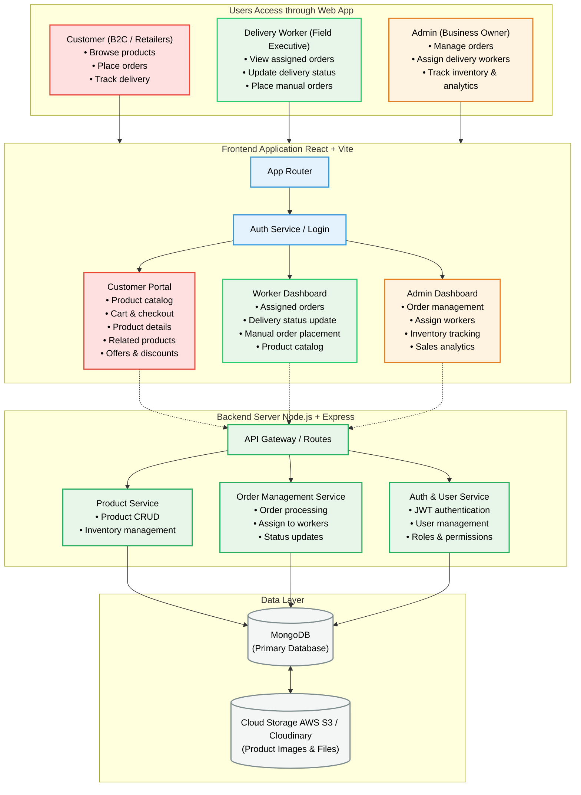

# Dinesh Agencies - FMCG Wholesale & Distribution
Smarter Distribution • Stronger Business • For a Better Tomorrow

Dinesh Agencies is a comprehensive B2B/B2C FMCG (Fast-Moving Consumer Goods) wholesale web application built to streamline operations between administrators, delivery workers, and retail customers.

---

## 🚀 Tech Stack

### Frontend
- **React 18**
- **Vite**
- **React Router DOM**
- **Vanilla CSS**
- **Lucide React**
- **React Hooks**

### Backend
- **Node.js**
- **Express.js**
- **MongoDB**
- **JWT** (JSON Web Tokens)
- **AWS S3 / Cloudinary**

---

## 🔄 System Flow

1. **Users access the web app** (Customer / Worker / Admin)
2. **Frontend handles UI & auth** (React + Vite)
3. **API calls go to backend** (Node.js + Express)
4. **Services interact with database** (MongoDB / Cache)
5. **Response sent back to frontend**

---

## 🌟 Key Features

### 🛒 Customer Portal
- Top brands marquee
- Product categories
- Price calculation & discounts
- Quick cart controls
- Out of stock handling

### 🚚 Worker Dashboard
- Assigned orders
- Delivery status update
- Manual ordering

### 📊 Admin Dashboard
- Order management
- Worker assignment
- Inventory & analytics

---

## 🏛️ System Architecture

---

## 🛠️ Deployment & Setup

### Prerequisites
- Node.js (v16 or higher)
- npm or yarn

### Installation
1. `cd frontend`
2. `npm install`
3. `npm run dev`

---

*Seamless Ordering For Customers • Efficient Delivery For Workers • Complete Control For Admins*
*Built with Modern Tech: React 18 | Node.js | MongoDB*
